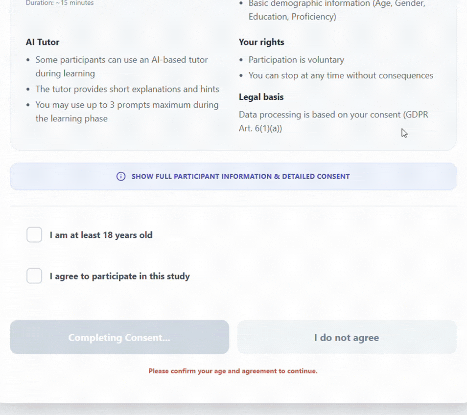

# German Vocabulary AI Tutor Experiment

This project is a **research platform** designed to measure the effectiveness of **Adaptive AI Feedback** versus **Static Feedback** in learning German vocabulary.  

## 🎥 Demos & Walkthrough

Consent form and info screen:



Experiment interface:


AI Tutor interface:


AI Generated content examples:

Good example would be the mnemonics on the flashcard screen:


Another example would be the generated short story and fun fact:
 

| **Condition A (Static Feedback)** | **Condition B (Adaptive AI)** |
|:---:|:---:|
| [*Insert Video/GIF Here*](#) | [*Insert Video/GIF Here*](#) |
| *Showcases basic recall & error message* | *Showcases Gemini-powered hints & explanations* |

---

## 🚀 Key Experimental Results

Our study compared **Static Feedback (Group A)** vs. **Adaptive AI Feedback (Group B)**.  
The results demonstrate that the **AI Companion significantly accelerates learning speed**.

### 📈 Metrics at a Glance

| Metric | Result | Interpretation |
| :--- | :--- | :--- |
| **Learning Efficiency** | **+153.5%** | Group B learned vocabulary **2.5x faster** (score per minute). |
| **Effect Size (Cohen's d)** | **1.11** | A **very large positive effect** in favor of the AI Tutor. |
| **Significance (p-value)** | **0.0039** | Statistically significant result (p < 0.01). |

*(Results based on N=32 participants, independent t-test)*

---

## 🏗️ Architecture & Tech Stack

This project is built with a modern, scalable full-stack architecture designed for real-time interaction and data logging.

### 🎨 Frontend (Client)
*   **React 19**: Component-based UI for dynamic state management.
*   **TypeScript**: Ensures type safety and robust code quality.
*   **Vite**: Ultra-fast build tool and development server.
*   **CSS Modules / Vanilla CSS**: Custom styling for a distraction-free learning environment.

### ⚙️ Backend (Server)
*   **FastAPI**: High-performance Python web framework for asynchronous request handling.
*   **Google Gemini Pro 1.5**: LLM integration for generating context-aware hints and explanations.
*   **Pandas**: Data manipulation for experiment logging and CSV export.
*   **Uvicorn**: ASIC server for high-throughput production deployment.

### 📐 System Design Highlights
*   **State Machine Logic**: The backend manages user states (`Learning`, `Testing`) to strictly control the experiment flow.
*   **Adaptive Feedback Loop**: Real-time analysis of user input triggers one of 3 feedback levels (Subtle Hint → Strong Hint → Correction).
*   **Session Persistence**: LocalStorage and backend session tracking ensure experiment continuity even on page refresh.

---

## 📦 Prerequisites

- **Python 3.10+**
- **Node.js v18+** and **npm**
- **Google Gemini API Key**  
  (Get one at https://aistudio.google.com/)

---

## 🛠️ Backend Setup (FastAPI)

The backend manages experiment logic, session state, and integration with **Google Gemini** for adaptive hints.

### 1️⃣ Navigate to the backend folder

```bash
cd backend
```

### 2️⃣ Create and activate a virtual environment

**Windows**

```bash
python -m venv .venv
.venv\Scripts\activate
```

**Mac / Linux**

```bash
python3 -m venv .venv
source .venv/bin/activate
```

### 3️⃣ Install dependencies

```bash
pip install fastapi uvicorn pandas google-genai python-dotenv
```

### 4️⃣ Configure Environment Variables

Create a `.env` file in the `backend/` directory:

```env
GEMINI_API_KEY=your_actual_api_key_here
```

### 5️⃣ Prepare Data

- Ensure `vocab.csv` is located in the `backend/` root directory
- Place image assets in:
  ```
  backend/data/images/
  ```

### 6️⃣ Run the server

```bash
uvicorn app.main:app --reload
```

The backend will be available at:  
**http://127.0.0.1:8000**

---

## 💻 Frontend Setup (React + Vite)

The frontend provides the experiment UI, handles character selection, and performs input validation.

### 1️⃣ Navigate to the frontend folder

```bash
cd frontend
```

### 2️⃣ Install dependencies

```bash
npm install
```

### 3️⃣ Proxy Configuration (Important)

Ensure `vite.config.ts` includes the proxy setup to avoid CORS issues:

```ts
server: {
  proxy: {
    '/experiment': 'http://127.0.0.1:8000',
    '/images': 'http://127.0.0.1:8000'
  }
}
```

### 4️⃣ Run the development server

```bash
npm run dev
```

The frontend will be available at:  
**http://localhost:5173**

---

## 🧪 Testing the Experiment

1. Open **http://localhost:5173** in your browser
2. Select a **Condition**

### 🅰️ Condition A — Static Feedback
- Tests basic recall.
- Immediate **Correct / Incorrect** feedback.
- Full answer shown after an incorrect attempt.

### 🅱️ Condition B — Adaptive Feedback (AI Companion)
- Uses **Gemini-powered hints**.
- Feedback progression:
  - **Subtle hint**
  - **Strong hint**
  - Full answer revealed on the **3rd attempt**.

---

## ✅ Key Features to Test

### Noun Capitalization
In Condition B (Learning phase), submit a noun in lowercase.
- `apfel` → ❌ (Prompts correction)
- `Apfel` → ✅

### Article Selector
Ensure **der / die / das** is selected before submitting a noun.

### Phase Transitions
Completing the required number of tasks should trigger:
- Pre-test → Learning
- Learning → Post-test
