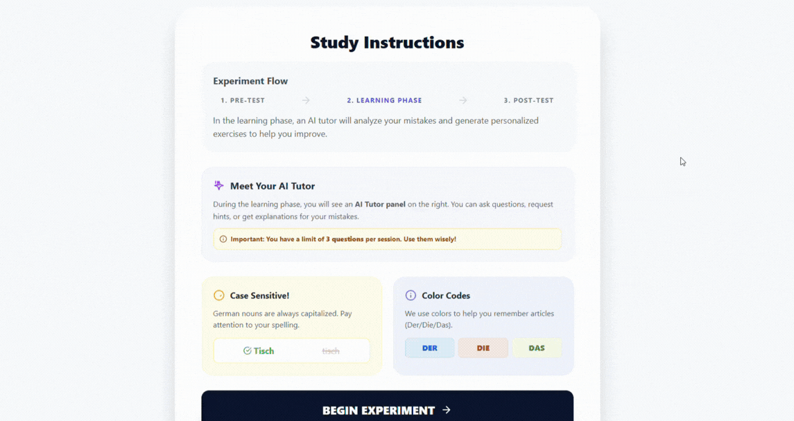
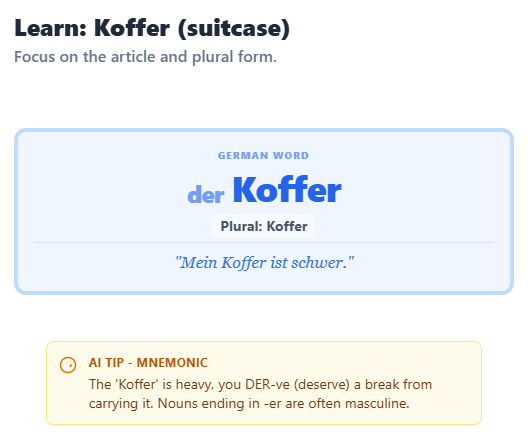
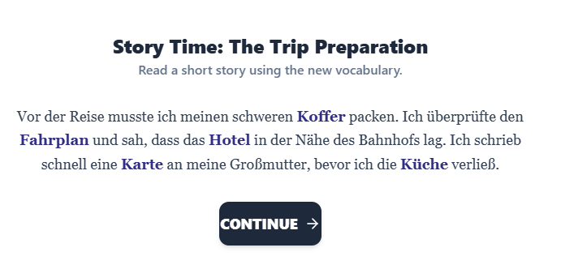
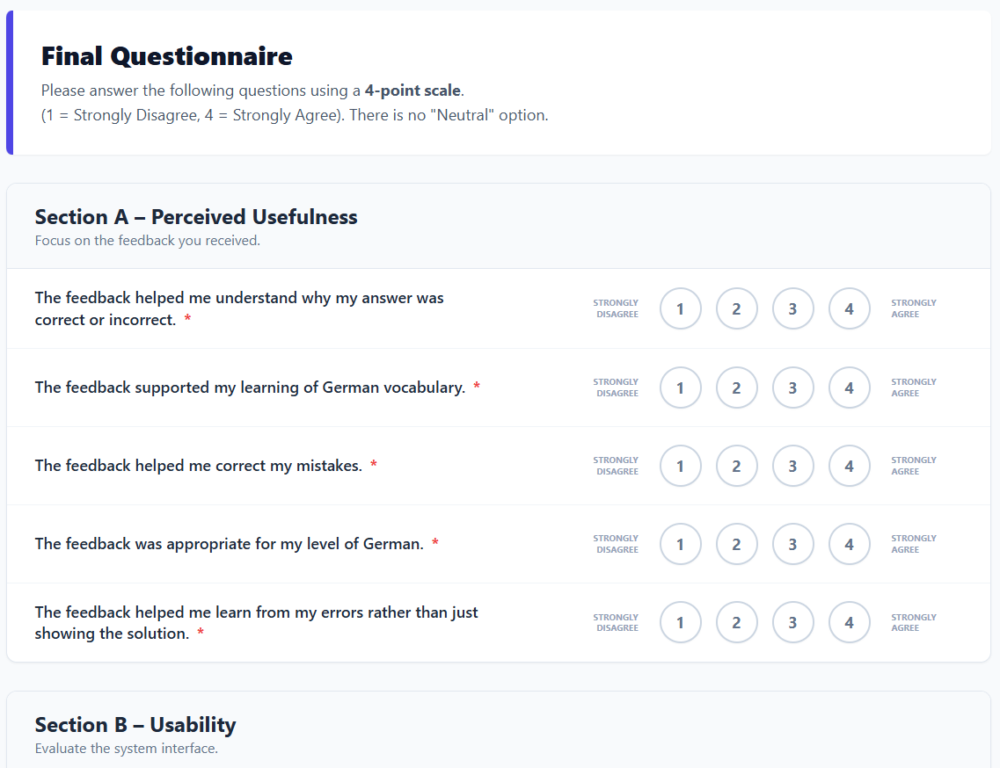
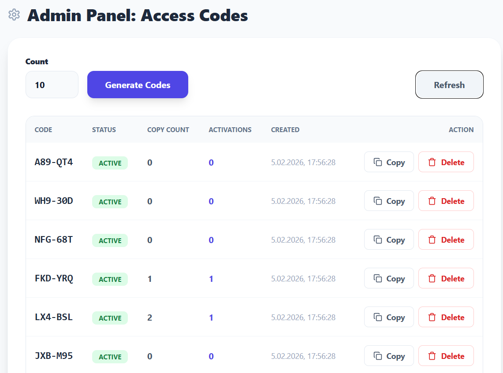
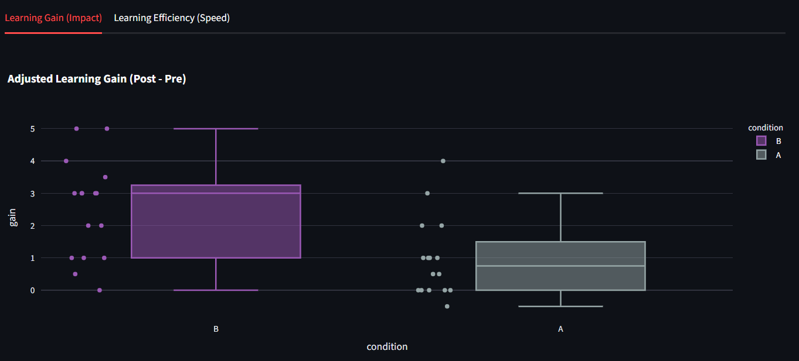
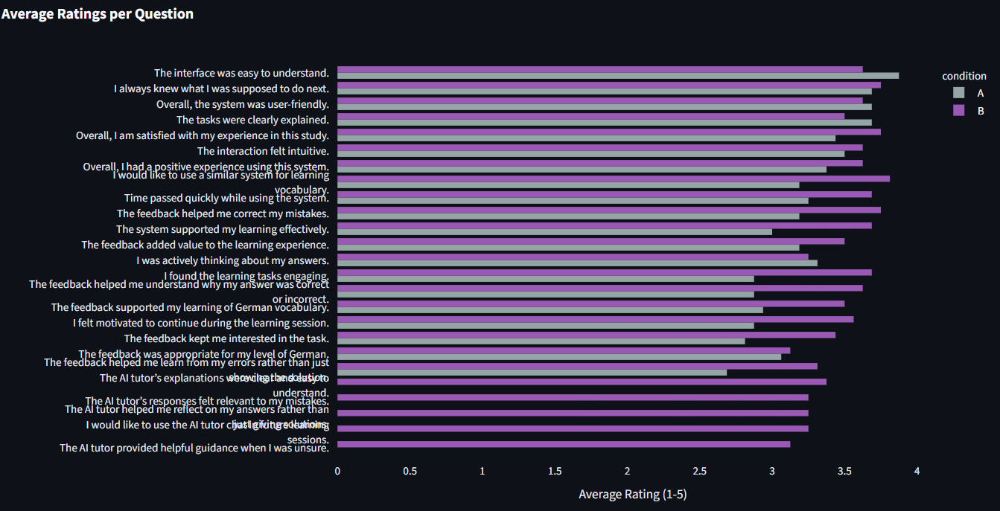
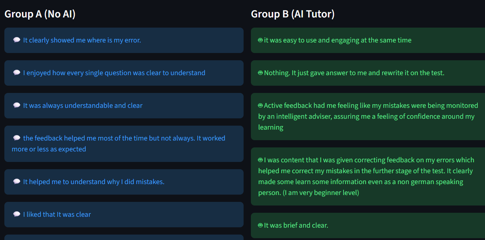

# German Vocabulary AI Tutor Experiment

This project is a **research platform** designed to measure the effectiveness of **Adaptive AI Feedback** versus **Static Feedback** in learning German vocabulary.  

📱 Application Walkthrough & UI Showcase

A comprehensive look at the research platform's interface and the pedagogical differences between experimental conditions.

1️⃣ Onboarding & Consent

Every session begins with a standardized information screen and a legally compliant consent form to ensure ethical data collection.

<p align="center">

</p>

2️⃣ Comparison: Static vs. Adaptive Feedback

This is the core of our research. The following table illustrates the fundamental difference in how the system handles user errors. We use HTML table tags to ensure the comparisons remain side-by-side in all viewing environments.

<table width="100%">
<tr>
<td align="center" width="50%" style="vertical-align: top;">
<b>Condition A: Static (Control)</b><br />

<p><i>Static study design.</i></p>
</td>
<td align="center" width="50%" style="vertical-align: top;">
<b>Condition B: Adaptive (AI)</b><br />

<p><i>Gemini-powered personalised study.</i></p>
</td>
</tr>
</table>

3️⃣ AI-Powered Learning Aids

In the Adaptive condition, Gemini 1.5 Pro generates real-time pedagogical content tailored to the specific word and the user's previous mistakes.

Personal Mnemonics

AI creates associations to help students remember the grammatical gender of nouns.

<p align="center">

</p>

Contextual Consolidation

At the end of each thematic module, the AI synthesizes learned words into fresh narratives.

<p align="center">


</p>

Interactive Tutor Chat

Students can ask the AI Tutor for clarification on complex grammar rules or example sentences.

<p align="center">

</p>

4️⃣ Assessment & Administration

The platform includes internal tools for measuring subjective user experience and managing the experiment lifecycle.

Final Survey (Likert Scale)

<p align="center">

</p>

Admin Dashboard

<p align="center">

</p>

📈 Data Insights

Statistical outputs generated by the platform showing the significant learning delta between the two groups.

<p align="center">



</p>

## 🚀 Key Experimental Results

Our study compared **Static Feedback (Group A)** vs. **Adaptive AI Feedback (Group B)**.  
The results demonstrate that the **AI Companion significantly accelerates learning speed**.

### 📈 Metrics at a Glance

| Metric | Result | Interpretation |
| :--- | :--- | :--- |
| **Learning Efficiency** | **+153.5%** | Group B learned vocabulary **2.5x faster** (score per minute). |
| **Effect Size (Cohen's d)** | **1.11** | A **very large positive effect** in favor of the AI Tutor. |
| **Significance (p-value)** | **0.0039** | Statistically significant result (p < 0.01). |

*(Results based on N=32 participants, independent t-test)*

---

## 🏗️ Architecture & Tech Stack

This project is built with a modern, scalable full-stack architecture designed for real-time interaction and data logging.

### 🎨 Frontend (Client)
*   **React 19**: Component-based UI for dynamic state management.
*   **TypeScript**: Ensures type safety and robust code quality.
*   **Vite**: Ultra-fast build tool and development server.
*   **CSS Modules / Vanilla CSS**: Custom styling for a distraction-free learning environment.

### ⚙️ Backend (Server)
*   **FastAPI**: High-performance Python web framework for asynchronous request handling.
*   **Google Gemini Pro 1.5**: LLM integration for generating context-aware hints and explanations.
*   **Pandas**: Data manipulation for experiment logging and CSV export.
*   **Uvicorn**: ASIC server for high-throughput production deployment.

### 📐 System Design Highlights
*   **State Machine Logic**: The backend manages user states (`Learning`, `Testing`) to strictly control the experiment flow.
*   **Adaptive Feedback Loop**: Real-time analysis of user input triggers one of 3 feedback levels (Subtle Hint → Strong Hint → Correction).
*   **Session Persistence**: LocalStorage and backend session tracking ensure experiment continuity even on page refresh.

---

## 📦 Prerequisites

- **Python 3.10+**
- **Node.js v18+** and **npm**
- **Google Gemini API Key**  
  (Get one at https://aistudio.google.com/)

---

## 🛠️ Backend Setup (FastAPI)

The backend manages experiment logic, session state, and integration with **Google Gemini** for adaptive hints.

### 1️⃣ Navigate to the backend folder

```bash
cd backend
```

### 2️⃣ Create and activate a virtual environment

**Windows**

```bash
python -m venv .venv
.venv\Scripts\activate
```

**Mac / Linux**

```bash
python3 -m venv .venv
source .venv/bin/activate
```

### 3️⃣ Install dependencies

```bash
pip install fastapi uvicorn pandas google-genai python-dotenv
```

### 4️⃣ Configure Environment Variables

Create a `.env` file in the `backend/` directory:

```env
GEMINI_API_KEY=your_actual_api_key_here
```

### 5️⃣ Prepare Data

- Ensure `vocab.csv` is located in the `backend/` root directory
- Place image assets in:
  ```
  backend/data/images/
  ```

### 6️⃣ Run the server

```bash
uvicorn app.main:app --reload
```

The backend will be available at:  
**http://127.0.0.1:8000**

---

## 💻 Frontend Setup (React + Vite)

The frontend provides the experiment UI, handles character selection, and performs input validation.

### 1️⃣ Navigate to the frontend folder

```bash
cd frontend
```

### 2️⃣ Install dependencies

```bash
npm install
```

### 3️⃣ Proxy Configuration (Important)

Ensure `vite.config.ts` includes the proxy setup to avoid CORS issues:

```ts
server: {
  proxy: {
    '/experiment': 'http://127.0.0.1:8000',
    '/images': 'http://127.0.0.1:8000'
  }
}
```

### 4️⃣ Run the development server

```bash
npm run dev
```

The frontend will be available at:  
**http://localhost:5173**

---


## ✅ Key Features to Test

### Noun Capitalization
In Condition B (Learning phase), submit a noun in lowercase.
- `apfel` → ❌ (Prompts correction)
- `Apfel` → ✅

### Article Selector
Ensure **der / die / das** is selected before submitting a noun.

### Phase Transitions
Completing the required number of tasks should trigger:
- Pre-test → Learning
- Learning → Post-test
